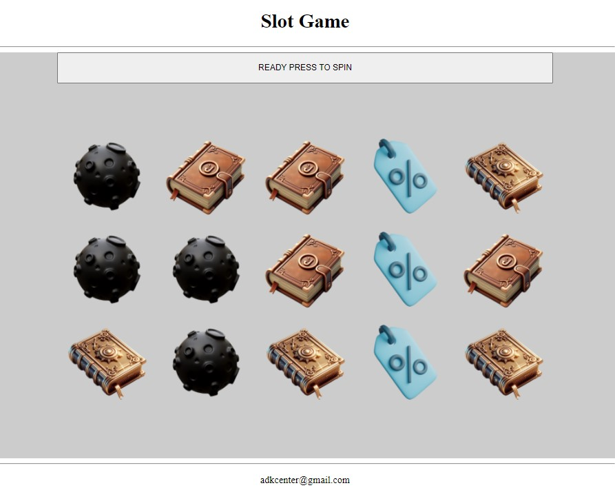
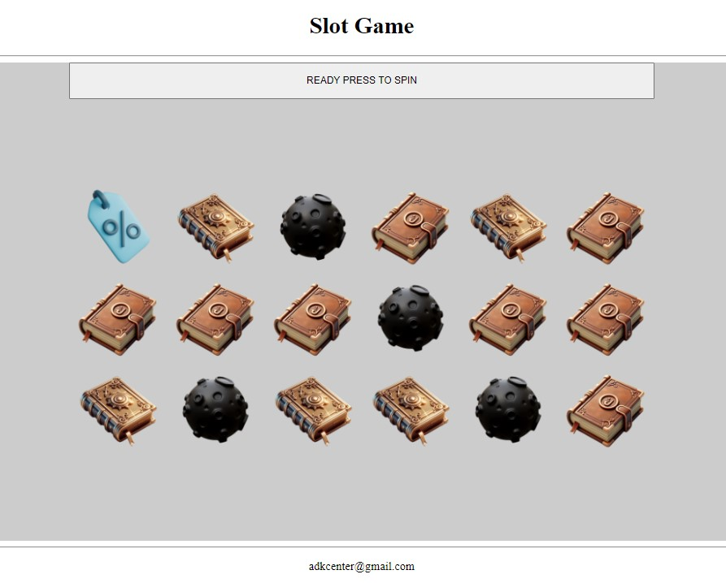
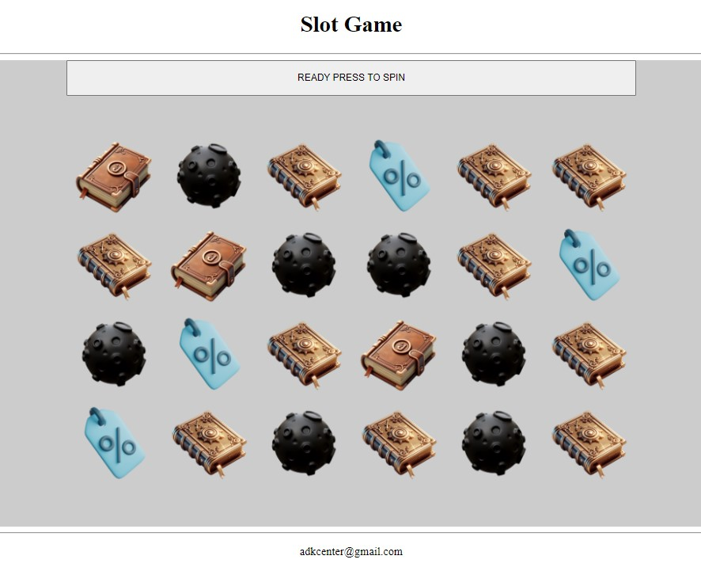
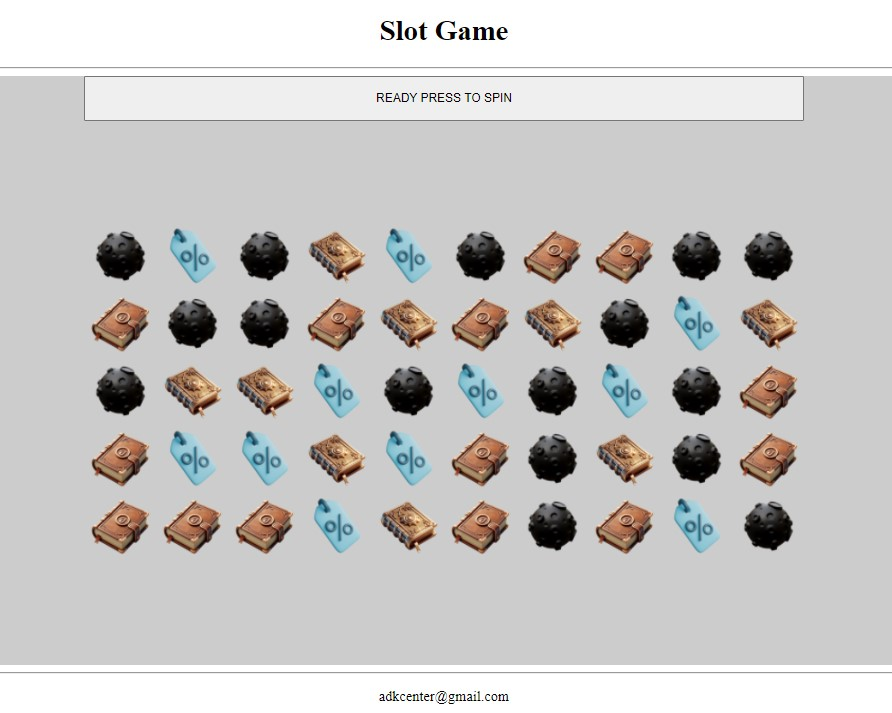

# Angular\Pixi\Gsap Slot game example (test task)


[Donchenko Artem: adkcenter@gmail.com](mailto:adkcenter@gmail.com)

### Carefully  
``` 
constructor(private elementRef: ElementRef, private ngZone: NgZone, _slotGameService: SlotGameService) {
    this.slotGameService = _slotGameService;
    // runOutsideAngular to save PIXI requestAnimationFrame
    afterRender(() => {
      this.ngZone.runOutsideAngular(() => {
        this.slotGameService.createApp(this.elementRef.nativeElement);
      });
    })
  }

```
Look: src/app/components/slotgame

## When You creating a canvas, it must be outside the angular area, otherwise it may lead to performance problems.
## Or often to ticker conflict problems as pixi, angular, gsap each have owen one. 
---


## Install

```cmd
git clone https://github.com/artdon/angular-pixi-slots.git
```
or
```cmd
gh repo clone artdon/angular-pixi-slots
```
then
```cmd
npm i
```
## Run

```cmd
ng serve --open
```
## Other run commands

[package.json::scripts](package.json)

# Configuration
[globalStorage.ts](src/app/components/slotgame/servise/game/common/globalStorage.ts)

<hr>

```
REELS_COUNT: 5,
SYMBOLS_PER_REEL: 4,
VISIBLE_SYMBOLS: 3,
```



<hr>

```
REELS_COUNT: 6,
SYMBOLS_PER_REEL: 4,
VISIBLE_SYMBOLS: 3,
```



<hr>

```
REELS_COUNT: 6,
SYMBOLS_PER_REEL: 5,
VISIBLE_SYMBOLS: 4,
```



<hr>

```
REELS_COUNT: 10,
SYMBOLS_PER_REEL: 6,
VISIBLE_SYMBOLS: 5,
```



## Assets tune
```
IMAGE_PATH: './assets/slotgame/images/',
SYMBOLS_PATH_ID: 'symbol',
SYMBOL_IMAGE_MANIFEST: {
symbol1: 'symbol/1.png',
symbol2: 'symbol/2.png',
symbol3: 'symbol/3.png',
symbol4: 'symbol/4.png',
```

## Animations tune
```
START_ALPHA_DURATION: 1,
REEL_STEP_HEIGHT: 10,
EXTRA_REEL_STEPS: 3,
REEL_SPEED_GROW: 5,
MIN_SPIN_TIME: 2500,
REEL_TIME_GROW: 500,
BLUR_MULTIPLY: 150,
```

## Canvas tune
```
antialias: false,
backgroundAlpha: 1,
backgroundColor: '0xCCCCCC',
clearBeforeRender: true,
context: null,
hello: false,
powerPreference: "low-power",
premultipliedAlpha: false,
preserveDrawingBuffer: false,
width: 800,
height: 600
```

## INSIDE CONS Do not change
```
REEL_WIDTH: 160,
SYMBOL_SIZE: 150
```
